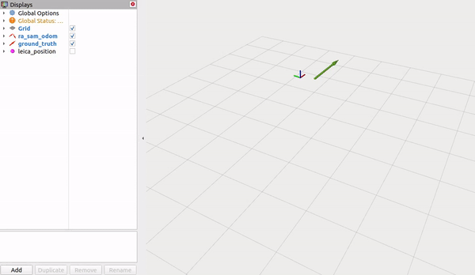
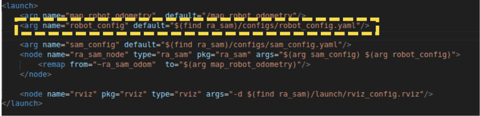

# Range-aided Localization
This repository contains code for range-aided localization. The code supports two different modes of sensor fusion. More details on the algorithm will be made available soon..


## Installation

### Dependencies

The main dependencies are [ROS]() and [GTSAM](https://github.com/borglab/gtsam).

1. Installation instructions for ROS can be found here: [ROS Noetic instllation](http://wiki.ros.org/noetic/Installation/Ubuntu).

2. Install necessary dependencies.
```
sudo apt-get install libboost-all-dev
sudo apt-get install cmake
```

3. We require a slightly modified version of GTSAM:
```
git clone https://github.com/abhigoudar/gtsam.git -b custom_feature
cd gtsam
mkdir build
cmake ..
make check
make install
```

### Setup ROS workspace

1. Setup a ROS workspace and clone the necessary ROS dependencies:
```
mkdir -p ~/catkin_ws/src
cd ~/catkin_ws/src
git clone https://github.com/utiasDSL/measurement_msgs.git
```

2. Clone `ra_sam`
```
git clone https://github.com/utiasDSL/ra_sam.git
```

3. Build the code
```
cd ~/catkin_ws
catkin_make -DCMAKE_BUILD_TYPE=RelWDebInfo
```

## Testing with LSY Range-Aided Localization dataset

The funcationality of the code can be tested using a rosbag from the [LSY Range-Aided Localization](https://utiasdsl.github.io/utias_ra_loc) dataset. 

1. Download the [UTIAS_vicon_12122022](https://utiasdsl.github.io/utias_ra_loc/03_UTIAS_vicon_1212022.html#data-files) dataset.

2. Unzip the dataset.

3. Run the launch file
```
source ~/catkin_ws/devel/setup.bash
roslaunch ra_sam default.launch --screen
```

4. Play the rosbag from dataset

```
source ~/catkin_ws/deve/setup.bash
rosbag play <path-to-dataset>/trial1/sensor_data.bag
```

5. If everything works correctly, you should see the following visualization in Rviz:

<p align="center">
    
</p>


## Testing with different datasets

To test with different rosbags from LSY Range-Aided Localization dataset, edit the `default.launch` file and insert the path of `robot_config.yaml` for the corresponding dataset in the `robot_config` field (highlighted below) and repeat the steps from the previous section.

<p align="center">
    
</p>

## Known issues
1. In some cases, after installing GTSAM, `libmetis-gtsam.so` might not be found during roslaunch. This can result in a crash of `ra_sam` node. This can be addressed by updating the library path:
   ```
   echo export LD_LIBRARY_PATH="$LD_LIBRARY_PATH:/usr/local/lib" >> ~/.bashrc
   source ~/.bashrc
   ```


